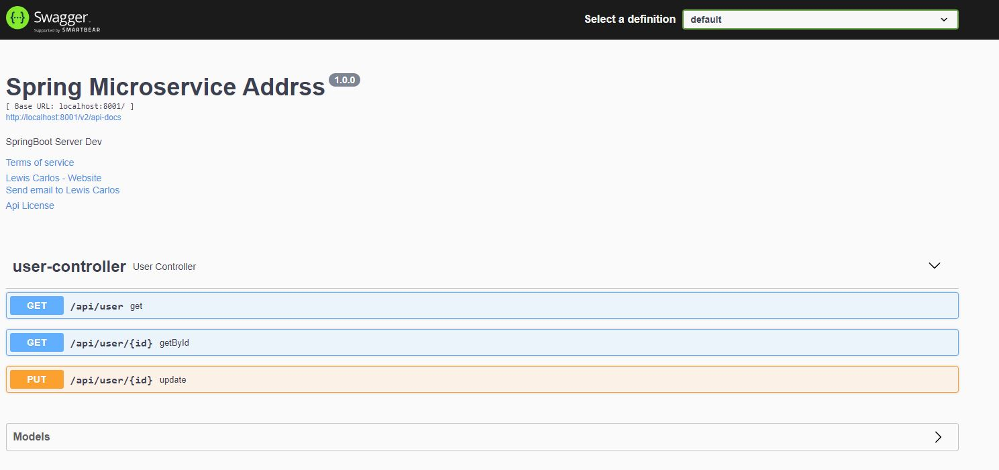
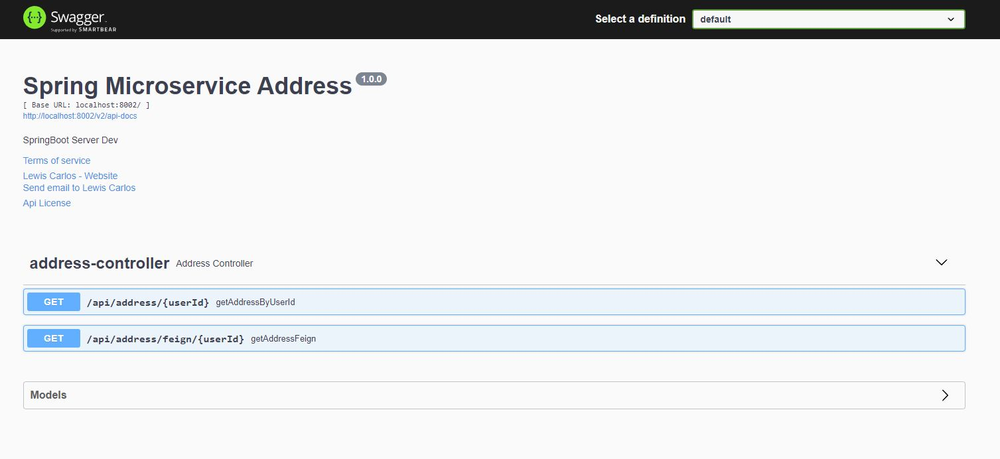
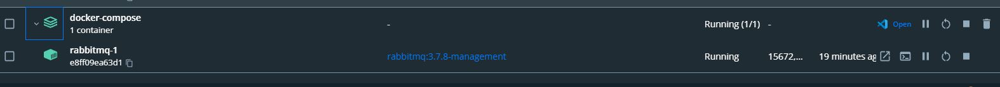
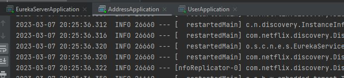

<h1>🖼 Springboot Microservice User Address </h1>  

<h2>Description English</h2>

 Using the API User you can Update a new User and the API Address Will be automatically be updated because of 
RabbitMQ and Feign Client So basically when you Update the User the new properties will be send by RabbitMQ 
to the Address Service and Update the old User. 

 
<h2>Descrição Português</h2>

Usando a API User, você pode atualizar um novo usuário  é a API Address será atualizado automaticamente devido a
RabbitMQ e Feign Client Então, basicamente, quando você atualizar o usuário, as novas propriedades serão enviadas pelo RabbitMQ
ao Serviço de Address e Atualize o Usuário antigo.

 

## 🚀 Tech Usada 
 
- Spring Boot 
- Spring Cloud Microserviços  
-   Swagger  
- Docker-compose 
- Feign Client 
-   Rest   

 
<h3>How to Run</h3>

First run the folder docker-compose with the command "docker-compose up" then run the Eureka Server application
then User finally the Address

 

User

Address

Docker

Services

 
 
<h3>## Linkedin Below - Linkedin ABaixo</h3>

<h4 align="center">
   Created by   <a href="https://www.linkedin.com/in/luiz-carlos-b50693173/" target="_blank"> Luiz Carlos </a>
</h4>

</html>
